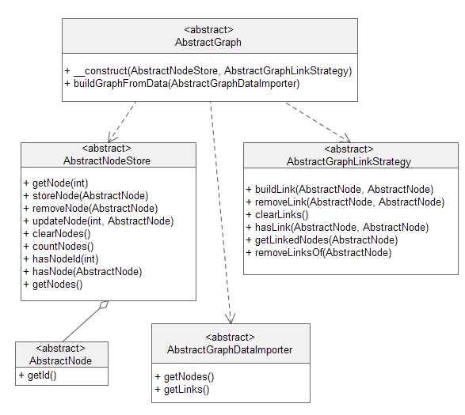
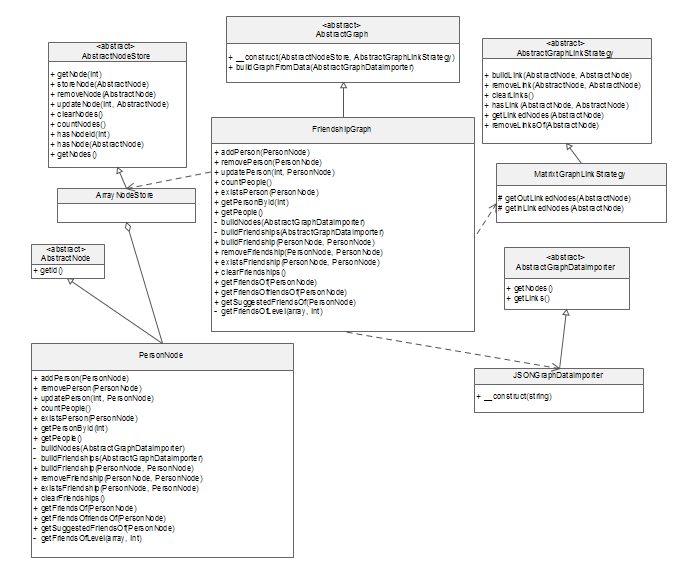

FRIENDSHIP GRAPH Data Structure
===============================

This repository contains code for the social graph data structure written in response to an interview.
The recruiter to create a social graph data from a json provided data which allows for people nodes manipulation, 
making/breaking relationships, and allows to:

+ Get a person's friends
+ GET a person's friends of friends
+ GET a person's suggested friends : 

> People in the group who know two or more direct friends of the chosen person, but are not directly connected to her.


CODE STRUCTURE
---------------

In response to that challenge a library had to be written inside the namespace **_PACO\SOCL_** 
to implement a generic graph data structure. The graph abstraction itself use decoupled components to 
store his nodes, to represent his edges and to import existant data to build itself.



The **AbstractGraph** uses a **AbstractNodeStore**: that store can be implemented in many ways. One can be an array, another can use a file, or a database, or a remote backend like [Kinvey](http://www.kinvey.com) or [Parse](https://parse.com).

The **AbstractGraph** uses a **AbstractGraphLinkStrategy**: that represents a way of storing relationship infos inside the graph. Most used strategies are Adjacency Matrix and Adjancency List.


The **AbstractGraph** use a **AbstractGraphDataImporter**: that provides a real implementation of the **AbstractGraph** to import data 
from various sources origins and formats: _JSON_, _XML_, _SQL_, _NoSQL_, _BAAS_, _Web services_, ...


The whole code contains that library and a PHP [Silex](http://silex.sensiolabs.org) REST server to serve requests again the graph. Unit and functions tests are also included.

COMPONENTS
------------



The **FriendshipGraph** is the implementation of an abstract graph defined earlier. It uses an **ArrayNodeStore** to store nodes inside an array, and uses a **MatrixGraphLinkStrategy** to store relationships using an adjacency matrix.

In order to importe data provided by the recruiter as a json file, the social graph instance uses an instance of a 
**JSONGraphDataImporter** to read data from the data.json file and to extract nodes and relationships infos.
Each node inside our social graph is an instance of **PersonNode** class which extends **AbstractNode**. 

Structured this way, the social graph can import data from differents data sources without changing it's inner 
implementation. The graph can also change the way it store it's nodes or relationships without changing it's inner code.
It decouples dependencies and make code testing and evolution easy.

For example a **SQLITEGraphDataImporter** and **XMLGraphDataImporter** are provided and can be used in place of the default **JSONGraphDataImporter**.


APPLICATION
-------------
The application is a PHP [Silex](http://silex.sensiolabs.org) REST server which servers the social graph API.
The Silex application uses three service providers: 

+ A **FriendshipGraphServiceProvider** which represents an instance of the **FriendshipGraph** graph data structure 
+ A **GraphDataSerializerServiceProvider** used to serialize response in json format to the REST client
+ A **SocialGraphAPIControllerProvider** which encapsulate all request handling logic inside a [Silex](http://silex.sensiolabs.org) Controller


HOW TO SETUP
------------

In order to run the application, PHP is needed for the REST server and Git to fetch the code. Then use this command from your command line:

```
$ git clone https://github.com/papepapes/socl socl
$ cd socl
```


Then start a local simple PHP server like this: (if you do not use a XAMP stack)

```
php -S 127.0.0.1:9090
```

Finally access the application on your browser at specified port: _9090_ in our case.

REST API ENDPOINTS
------------------

The following url are used to play with the URL:

+ GET {base_url}/api/v1/people : GET the list of persons
+ GET {base_url}/api/v1/people/{id} : GET a singular person 
+ GET {base_url}/api/v1/people/{id}/friends : GET a singular person's friends 
+ GET {base_url}/api/v1/people/{id}/friends/friends : GET a singular person's friends of friends
+ GET {base_url}/api/v1/people/{id}/friends/suggested : GET a singular person's suggested friends
+ POST {base_url}/api/v1/people : REGISTER A person inside the social graph
+ POST {base_url}/api/v1/people/{pid}/friends/{fid} : Make two persons friends. Build a friendship link.
+ PUT {base_url}/api/v1/people/{id} : Update a person's record.
+ DELETE {base_url}/api/v1/people/{id} : Delete a person's record.
+ DELETE {base_url}/api/v1/people/{pid}/friends/{fid} : Remove friendship between two persons.

{base_url} is your server url and {id}/{pid}/{fid} are integers values for concerned persons.


HOW TO RUN TESTS
----------------

In order to run the tests [PHPUnit](http://phpunit.de) will be needed for the Unit tests and [CodeCeption](http://codeception.com) for the functional/API tests.
This repo provide copies of both [PHPUnit](http://phpunit.de) and [CodeCeption](http://codeception.com) phar files inside the bin directory. 
Run unit tests like this:

```
php bin/phpunit.phar 
```

Run functional/REST tests like this:

```
php bin/cedecept.phar 
```


TODO
-------

 + Write an AngularJS client to play with the REST API
 + 

FINAL NOTES 
-----------

The design goal is to implement our home made data structure to tackle social graph manipulation.
But in real application and for performance/time reasons, thinks can be a lot easier.

For the backend a real graph database storage can(MUST) be used like [Neo4J](http://www.neo4j.org) or [ArangoDB](http://arangodb.org) and all or most of 
the application logic can be directly implemented inside the backend. Since thoses backends provide a REST endpoint,
client can be of any type or even another server.


